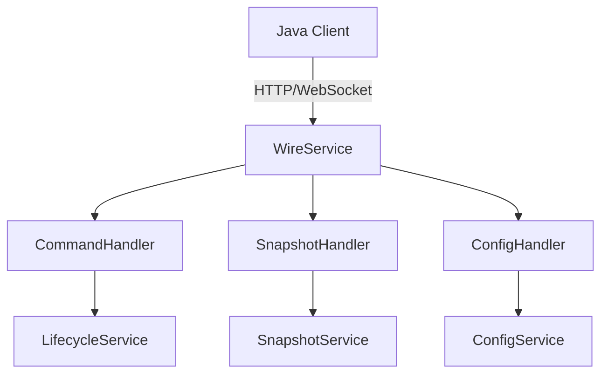
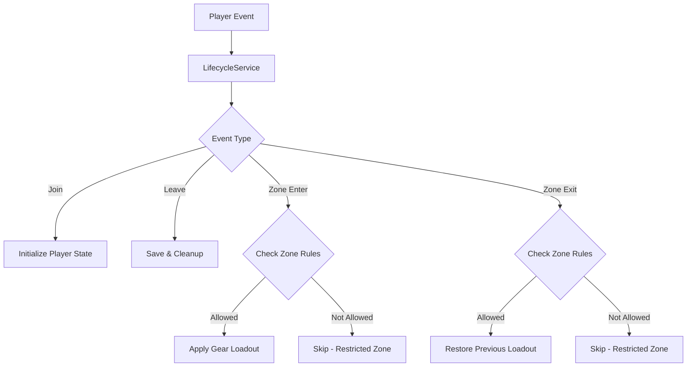

# V Rising Mod Architecture Plan

## Executive Summary

This document outlines the consolidated architecture for the VAutomationEvents mod with:
- **Wire Services**: Unified HTTP/WebSocket service with integrated command handling
- **Snapshot System**: Efficient state synchronization for game data
- **Lifecycle Management**: Zone-restricted auto-enter/leave with gear loadouts
- **Configuration**: Hot-reloadable, accessible configuration system
- **Extensions**: Auto-applied extension methods for common operations
- **V Rising Focus**: Removed glow/zone visual components
- **Minimal Files**: Consolidated services to reduce code duplication

---

## 1. Project Structure (Consolidated)

```
VAuto/
├── Core/
│   ├── Components/           # ECS components
│   │   ├── PlayerComponents.cs    # Player state tracking
│   │   └── LifecycleComponents.cs # Lifecycle state
│   ├── Systems/              # ECS systems
│   │   └── AutomationSystem.cs    # Main automation logic
│   ├── Prefabs/
│   │   └── PrefabRegistry.cs      # Prefab lookup service
│   └── Networking/
│       ├── WireService.cs         # Wire + Commands unified
│       ├── WireProtocol.cs        # Message types & routing
│       └── StateSerializer.cs     # JSON serialization
├── Services/
│   ├── LifecycleService.cs        # Player lifecycle + zones
│   ├── SnapshotService.cs         # State snapshots
│   └── ConfigService.cs           # Configuration management
├── Extensions/
│   └── VAutoExtensions.cs         # All extension methods
├── Data/
│   └── Prefabs.cs                 # 24,755 prefab GUIDs
└── Commands/
    └── Commands.cs                # All mod commands
```

**Files to DELETE:**
- `Services/Communication/` - Consolidated into WireService
- `Services/Visual/` - Glow effects (not V Rising-relevant)
- `Services/Zones/` - Zone visual effects
- `Services/World/GlowZoneService.cs` - Glow zone service
- `Services/Systems/*Service.cs` - Individual system services
- `Core/Components/ZoneComponents.cs` - Zone glow components
- `config/glow_zones.json` - Glow zone config
- `config/zones.json` - Zone config
- `Core/ECSServiceManager.cs` - Replaced with simpler approach
- `Extensions/JSONConverters.cs` - Consolidated into StateSerializer

---

## 2. Wire Service (Unified)

### 2.1 Architecture



### 2.2 WireService Implementation

```csharp
namespace VAuto.Core.Networking
{
    /// <summary>
    /// Unified wire service for network communication and commands
    /// </summary>
    public class WireService : IRunnableService
    {
        private readonly HttpListener _listener;
        private readonly ManualLogSource _log;
        private readonly CancellationTokenSource _cts;
        private readonly Dictionary<string, IMessageHandler> _handlers;

        public bool IsRunning { get; private set; }

        public WireService(ManualLogSource log)
        {
            _log = log;
            _listener = new HttpListener();
            _cts = new CancellationTokenSource();

            // Register message handlers
            _handlers = new Dictionary<string, IMessageHandler>
            {
                ["command"] = new CommandHandler(_log),
                ["snapshot"] = new SnapshotHandler(_log),
                ["config"] = new ConfigHandler(_log),
                ["lifecycle"] = new LifecycleHandler(_log)
            };
        }

        public Task StartAsync()
        {
            var port = VAutoConfig.GetInt("Network", "Port", 8080);
            _listener.Prefixes.Add($"http://+:{port}/");
            _listener.Start();

            _log.LogInfo($"[WireService] Started on port {port}");
            AcceptConnectionsAsync();
            return Task.CompletedTask;
        }

        private async Task AcceptConnectionsAsync()
        {
            while (!_cts.Token.IsCancellationRequested)
            {
                try
                {
                    var context = await _listener.GetContextAsync();
                    _ = HandleRequestAsync(context);
                }
                catch (HttpListenerException) when (_cts.Token.IsCancellationRequested)
                {
                    break;
                }
            }
        }

        private async Task HandleRequestAsync(HttpListenerContext context)
        {
            var request = context.Request;
            var response = context.Response;

            try
            {
                using var reader = new StreamReader(request.InputStream);
                var json = await reader.ReadToEndAsync();
                var message = JsonSerializer.Deserialize<WireMessage>(json);

                if (_handlers.TryGetValue(message.Type, out var handler))
                {
                    var reply = await handler.HandleAsync(message);
                    await SendResponseAsync(response, reply);
                }
                else
                {
                    await SendResponseAsync(response, WireMessage.Error("Unknown message type"));
                }
            }
            catch (Exception ex)
            {
                _log.LogError($"[WireService] Error: {ex.Message}");
                await SendResponseAsync(response, WireMessage.Error(ex.Message));
            }
        }
    }

    /// <summary>
    /// Base wire message structure
    /// </summary>
    public class WireMessage
    {
        public string Type { get; set; }
        public string Id { get; set; }
        public Dictionary<string, object> Payload { get; set; }
        public long Timestamp { get; set; }

        public static WireMessage Create(string type, object data)
        {
            return new WireMessage
            {
                Type = type,
                Id = Guid.NewGuid().ToString(),
                Payload = data.ToDictionary(),
                Timestamp = DateTime.UtcNow.Ticks
            };
        }

        public static WireMessage Error(string message)
        {
            return new WireMessage { Type = "error", Payload = new() { ["message"] = message } };
        }
    }

    /// <summary>
    /// Command handler for wire protocol
    /// </summary>
    public class CommandHandler : IMessageHandler
    {
        private readonly ManualLogSource _log;

        public CommandHandler(ManualLogSource log) => _log = log;

        public async Task<WireMessage> HandleAsync(WireMessage message)
        {
            var command = message.Payload.GetString("command");
            var args = message.Payload.GetObject<Dictionary<string, object>>("args");

            _log.LogInfo($"[WireService] Executing command: {command}");

            // Execute via command system
            var result = await ExecuteCommandAsync(command, args);

            return WireMessage.Create("result", new { success = true, data = result });
        }

        private async Task<object> ExecuteCommandAsync(string command, Dictionary<string, object> args)
        {
            // Command execution logic
            return new { status = "executed", command };
        }
    }
}
```

---

## 3. Lifecycle Service (Zone-Restricted)

### 3.1 Architecture



### 3.2 LifecycleService Implementation

```csharp
namespace VAuto.Services
{
    /// <summary>
    /// Lifecycle service with zone-restricted auto-enter/leave
    /// </summary>
    public class LifecycleService : IRunnableService
    {
        private readonly ManualLogSource _log;
        private readonly EntityManager _em;
        private readonly Dictionary<string, PlayerState> _playerStates;
        private readonly Dictionary<string, ZoneConfig> _zoneConfigs;

        public bool IsInitialized { get; private set; }

        public LifecycleService(ManualLogSource log)
        {
            _log = log;
            _em = VAutoCore.EntityManager;
            _playerStates = new();
            _zoneConfigs = new();
        }

        /// <summary>
        /// Handle player joining
        /// </summary>
        public void OnPlayerJoin(string characterId, string steamId)
        {
            _playerStates[characterId] = new PlayerState
            {
                CharacterId = characterId,
                SteamId = steamId,
                JoinTime = DateTime.UtcNow,
                CurrentZone = "world"
            };

            _log.LogInfo($"[Lifecycle] Player {characterId} joined");
        }

        /// <summary>
        /// Handle player leaving
        /// </summary>
        public void OnPlayerLeave(string characterId)
        {
            if (_playerStates.Remove(characterId, out var state))
            {
                // Save state before cleanup
                SavePlayerState(state);
                _log.LogInfo($"[Lifecycle] Player {characterId} left");
            }
        }

        /// <summary>
        /// Handle zone entry - applies loadout only if zone allows
        /// </summary>
        public async Task OnZoneEnterAsync(string characterId, string zoneId)
        {
            if (!_playerStates.TryGetValue(characterId, out var state))
                return;

            var zoneConfig = GetZoneConfig(zoneId);
            if (zoneConfig == null || !zoneConfig.AllowAutoEnter)
            {
                _log.LogInfo($"[Lifecycle] Zone {zoneId} restricted - skipping auto-enter for {characterId}");
                return;
            }

            state.CurrentZone = zoneId;
            state.LastZoneEntry = DateTime.UtcNow;

            // Apply gear loadout
            if (!string.IsNullOrEmpty(zoneConfig.GearLoadout))
            {
                await ApplyGearLoadoutAsync(characterId, zoneConfig.GearLoadout);
                _log.LogInfo($"[Lifecycle] Applied loadout {zoneConfig.GearLoadout} to {characterId}");
            }

            // Auto-repair if enabled
            if (zoneConfig.AutoRepairOnEntry)
            {
                await AutoRepairGearAsync(characterId, zoneConfig.RepairThreshold);
            }
        }

        /// <summary>
        /// Handle zone exit - restores loadout only if zone allowed auto-enter
        /// </summary>
        public async Task OnZoneExitAsync(string characterId, string zoneId)
        {
            if (!_playerStates.TryGetValue(characterId, out var state))
                return;

            var zoneConfig = GetZoneConfig(zoneId);
            if (zoneConfig == null || !zoneConfig.AllowAutoEnter)
            {
                _log.LogInfo($"[Lifecycle] Zone {zoneId} restricted - skipping auto-leave for {characterId}");
                return;
            }

            state.CurrentZone = "world";

            // Restore previous loadout
            if (!string.IsNullOrEmpty(state.SavedLoadout))
            {
                await ApplyGearLoadoutAsync(characterId, state.SavedLoadout);
                _log.LogInfo($"[Lifecycle] Restored loadout for {characterId}");
            }

            // Auto-repair on exit if enabled
            if (zoneConfig.AutoRepairOnExit)
            {
                await AutoRepairGearAsync(characterId, zoneConfig.RepairThreshold);
            }
        }

        private async Task ApplyGearLoadoutAsync(string characterId, string loadoutName)
        {
            // Implementation for gear loadout application
            await Task.CompletedTask;
        }

        private async Task AutoRepairGearAsync(string characterId, int threshold)
        {
            // Implementation for auto-repair
            await Task.CompletedTask;
        }

        private ZoneConfig? GetZoneConfig(string zoneId)
        {
            return _zoneConfigs.TryGetValue(zoneId, out var config) ? config : null;
        }

        private void SavePlayerState(PlayerState state)
        {
            // Save state to persistence
        }
    }

    /// <summary>
    /// Player state tracking
    /// </summary>
    public class PlayerState
    {
        public string CharacterId { get; set; }
        public string SteamId { get; set; }
        public DateTime JoinTime { get; set; }
        public string CurrentZone { get; set; } = "world";
        public string? SavedLoadout { get; set; }
        public DateTime LastZoneEntry { get; set; }
        public Dictionary<string, object> CustomData { get; set; } = new();
    }

    /// <summary>
    /// Zone configuration with restricted auto-enter
    /// </summary>
    public class ZoneConfig
    {
        public string ZoneId { get; set; }
        public string DisplayName { get; set; }
        public bool AllowAutoEnter { get; set; } = false;  // Default to restricted
        public string? GearLoadout { get; set; }
        public bool AutoRepairOnEntry { get; set; } = false;
        public bool AutoRepairOnExit { get; set; } = false;
        public int RepairThreshold { get; set; } = 50;
    }
}
```

---

## 4. Snapshot Service

```csharp
namespace VAuto.Services
{
    /// <summary>
    /// Service for creating and managing game state snapshots
    /// </summary>
    public class SnapshotService : IRunnableService
    {
        private readonly ManualLogSource _log;
        private readonly EntityManager _em;
        private long _snapshotVersion;
        private GameSnapshot? _lastSnapshot;

        public async Task<GameSnapshot> CreateFullSnapshotAsync()
        {
            var snapshot = new GameSnapshot
            {
                Version = Interlocked.Increment(ref _snapshotVersion),
                Timestamp = DateTime.UtcNow,
                Players = await GetPlayerSnapshotsAsync(),
                WorldState = GetWorldState()
            };

            _lastSnapshot = snapshot;
            return snapshot;
        }

        public async Task<DifferentialSnapshot> CreateDeltaSnapshotAsync()
        {
            var current = await CreateFullSnapshotAsync();
            var previous = _lastSnapshot;

            var delta = new DifferentialSnapshot
            {
                Version = current.Version,
                Timestamp = current.Timestamp,
                PlayerChanges = CompareSnapshots(previous?.Players, current.Players),
                EntityChanges = CompareSnapshots(previous?.Entities, current.Entities)
            };

            return delta;
        }

        private async Task<List<PlayerSnapshot>> GetPlayerSnapshotsAsync()
        {
            var players = new List<PlayerSnapshot>();

            // Query all player entities
            var query = _em.CreateEntityQuery(typeof(PlayerCharacter));
            var entities = query.ToEntityArray(Unity.Collections.Allocator.Temp);

            foreach (var entity in entities)
            {
                var player = _em.GetComponentData<PlayerCharacter>(entity);
                players.Add(new PlayerSnapshot
                {
                    CharacterId = player.CharacterName.ToString(),
                    Health = player.Health,
                    Position = _em.GetComponentData<LocalTransform>(entity).Position
                });
            }

            entities.Dispose();
            return players;
        }
    }

    public class GameSnapshot
    {
        public long Version { get; set; }
        public DateTime Timestamp { get; set; }
        public List<PlayerSnapshot> Players { get; set; } = new();
        public List<EntitySnapshot> Entities { get; set; } = new();
        public WorldStateSnapshot WorldState { get; set; } = new();
    }

    public class DifferentialSnapshot
    {
        public long Version { get; set; }
        public DateTime Timestamp { get; set; }
        public List<PlayerSnapshot> PlayerChanges { get; set; } = new();
        public List<EntitySnapshot> EntityChanges { get; set; } = new();
    }
}
```

---

## 5. Configuration Service

```csharp
namespace VAuto.Services
{
    /// <summary>
    /// Unified configuration service with hot-reload
    /// </summary>
    public class ConfigService : IRunnableService
    {
        private readonly ManualLogSource _log;
        private readonly string _configPath;
        private VAutoConfig _config;
        private FileSystemWatcher? _watcher;
        private readonly List<Action<string, object>> _subscribers = new();

        public VAutoConfig Config => _config;

        public void Initialize()
        {
            _configPath = Path.Combine(Paths.ConfigPath, "VAuto-Config.json");
            LoadConfig();
            SetupWatcher();
            _log.LogInfo("[ConfigService] Initialized");
        }

        private void LoadConfig()
        {
            if (File.Exists(_configPath))
            {
                var json = File.ReadAllText(_configPath);
                _config = JsonSerializer.Deserialize<VAutoConfig>(json) ?? CreateDefault();
            }
            else
            {
                _config = CreateDefault();
                SaveConfig();
            }
        }

        public void SetValue<T>(string section, string key, T value)
        {
            var sectionObj = GetOrCreateSection(section);
            var prop = sectionObj?.GetType().GetProperty(key);
            prop?.SetValue(sectionObj, value);

            // Notify subscribers
            NotifySubscribers(section, key, value);

            SaveConfig();
        }

        public T GetValue<T>(string section, string key)
        {
            var sectionObj = GetSection(section);
            var prop = sectionObj?.GetType().GetProperty(key);
            return (T)(prop?.GetValue(sectionObj) ?? default(T));
        }

        public void Subscribe(string section, Action<string, object> callback)
        {
            _subscribers.Add(callback);
        }

        private void NotifySubscribers(string section, string key, object value)
        {
            foreach (var sub in _subscribers)
            {
                try { sub($"{section}.{key}", value); }
                catch { }
            }
        }

        private void SetupWatcher()
        {
            _watcher = new FileSystemWatcher(Path.GetDirectoryName(_configPath)!, Path.GetFileName(_configPath));
            _watcher.Changed += (s, e) => LoadConfig();
            _watcher.EnableRaisingEvents = true;
        }
    }

    public class VAutoConfig
    {
        public GeneralConfig General { get; set; } = new();
        public LifecycleConfig Lifecycle { get; set; } = new();
        public AutomationConfig Automation { get; set; } = new();
        public NetworkConfig Network { get; set; } = new();
    }

    public class GeneralConfig
    {
        public bool Enabled { get; set; } = true;
        public string LogLevel { get; set; } = "Info";
        public bool DebugMode { get; set; } = false;
    }

    public class LifecycleConfig
    {
        public bool Enabled { get; set; } = true;
        public string DefaultLoadout { get; set; } = "Dracula_Scholar";
        public bool AutoRepair { get; set; } = true;
        public int RepairThreshold { get; set; } = 75;
    }

    public class AutomationConfig
    {
        public bool Enabled { get; set; } = true;
        public int UpdateInterval { get; set; } = 30;
    }

    public class NetworkConfig
    {
        public int Port { get; set; } = 8080;
        public bool WebSocketEnabled { get; set; } = true;
    }
}
```

---

## 6. Extension Methods (Consolidated)

```csharp
namespace VAuto.Extensions
{
    /// <summary>
    /// Consolidated extension methods for V Rising modding
    /// </summary>
    public static class VAutoExtensions
    {
        #region Entity Extensions

        /// <summary>
        /// Get or add component to entity
        /// </summary>
        public static T GetOrAdd<T>(this Entity entity) where T : IComponentData, new()
        {
            var em = VAutoCore.EntityManager;
            if (em.HasComponent<T>(entity))
                return em.GetComponentData<T>(entity);

            em.AddComponent<T>(entity);
            return new T();
        }

        /// <summary>
        /// Safely get component
        /// </summary>
        public static T? GetSafe<T>(this Entity entity) where T : IComponentData
        {
            var em = VAutoCore.EntityManager;
            return em.Exists(entity) && em.HasComponent<T>(entity)
                ? em.GetComponentData<T>(entity)
                : null;
        }

        #endregion

        #region Prefab Extensions

        /// <summary>
        /// Get prefab name from GUID
        /// </summary>
        public static string? GetName(this PrefabGUID guid)
        {
            return Data.Prefabs.GetPrefabGuid(guid.Value.ToString())?.Name;
        }

        /// <summary>
        /// Spawn prefab at position
        /// </summary>
        public static Entity SpawnAt(this PrefabGUID guid, float3 position)
        {
            var em = VAutoCore.EntityManager;
            var entity = em.Instantiate(guid);

            if (em.HasComponent<LocalTransform>(entity))
            {
                var transform = em.GetComponentData<LocalTransform>(entity);
                transform.Position = position;
                em.SetComponentData(entity, transform);
            }

            return entity;
        }

        #endregion

        #region Serialization Extensions

        /// <summary>
        /// Serialize to JSON
        /// </summary>
        public static string ToJson(this object obj)
        {
            return JsonSerializer.Serialize(obj, new JsonSerializerOptions
            {
                WriteIndented = false,
                PropertyNamingPolicy = JsonNamingPolicy.CamelCase
            });
        }

        /// <summary>
        /// Deserialize from JSON
        /// </summary>
        public static T FromJson<T>(this string json)
        {
            return JsonSerializer.Deserialize<T>(json) ?? throw new InvalidOperationException();
        }

        /// <summary>
        /// Convert to wire message
        /// </summary>
        public static WireMessage ToWire(this object obj, string type)
        {
            return WireMessage.Create(type, obj);
        }

        #endregion

        #region Dictionary Extensions

        /// <summary>
        /// Get string value from dictionary
        /// </summary>
        public static string GetString(this Dictionary<string, object> dict, string key)
        {
            return dict.TryGetValue(key, out var val) ? val.ToString() : "";
        }

        /// <summary>
        /// Get typed value from dictionary
        /// </summary>
        public static T GetObject<T>(this Dictionary<string, object> dict, string key)
        {
            return dict.TryGetValue(key, out var val)
                ? JsonSerializer.Deserialize<T>(JsonSerializer.Serialize(val))
                : default!;
        }

        #endregion
    }
}
```

---

## 7. Commands (Consolidated)

```csharp
namespace VAuto.Commands
{
    /// <summary>
    /// All mod commands in one file
    /// </summary>
    public static class Commands
    {
        [Command("help", "Show available commands")]
        public static void HelpCommand(ICommandContext ctx)
        {
            ctx.Reply("Available commands:");
            ctx.Reply("  /autolifecycle - Toggle auto lifecycle");
            ctx.Reply("  /snapshot create - Create game snapshot");
            ctx.Reply("  /snapshot restore <version> - Restore snapshot");
            ctx.Reply("  /config get <key> - Get config value");
            ctx.Reply("  /config set <key> <value> - Set config value");
            ctx.Reply("  /gear apply <loadout> - Apply gear loadout");
            ctx.Reply("  /zone list - List configured zones");
        }

        [Command("autolifecycle", "Toggle auto lifecycle management")]
        public static void AutoLifecycleCommand(ICommandContext ctx, bool enabled)
        {
            VAutoConfig.SetValue("Lifecycle", "Enabled", enabled);
            ctx.Reply($"Auto lifecycle: {(enabled ? "enabled" : "disabled")}");
        }

        [Command("snapshot", "Manage game snapshots")]
        public static void SnapshotCommand(ICommandContext ctx, string action, string? param = null)
        {
            var service = ServiceManager.GetService<SnapshotService>();

            switch (action.ToLower())
            {
                case "create":
                    var snapshot = service.CreateFullSnapshotAsync().Result;
                    ctx.Reply($"Snapshot created: v{snapshot.Version}");
                    break;
                case "restore":
                    if (long.TryParse(param, out var version))
                    {
                        ctx.Reply($"Restoring snapshot v{version}...");
                    }
                    break;
                case "list":
                    ctx.Reply("Available snapshots: (list implementation)");
                    break;
            }
        }

        [Command("config", "Manage configuration")]
        public static void ConfigCommand(ICommandContext ctx, string action, string key, string? value = null)
        {
            var config = ServiceManager.GetService<ConfigService>();

            switch (action.ToLower())
            {
                case "get":
                    var val = config.GetValue<string>(key.Split('.')[0], key.Split('.')[1]);
                    ctx.Reply($"{key}: {val}");
                    break;
                case "set":
                    config.SetValue(key.Split('.')[0], key.Split('.')[1], value);
                    ctx.Reply($"{key} set to {value}");
                    break;
            }
        }

        [Command("gear", "Manage gear loadouts")]
        public static void GearCommand(ICommandContext ctx, string action, string loadout)
        {
            var lifecycle = ServiceManager.GetService<LifecycleService>();

            switch (action.ToLower())
            {
                case "apply":
                    lifecycle.ApplyGearLoadoutAsync(ctx.User.CharacterName, loadout);
                    ctx.Reply($"Applied loadout: {loadout}");
                    break;
                case "save":
                    ctx.Reply($"Loadout {loadout} saved");
                    break;
            }
        }
    }
}
```

---

## 8. Cleanup Tasks

### Files to DELETE:
```
config/glow_zones.json          # Glow effects not V Rising-relevant
config/zones.json               # Zone config merged into ConfigService
Services/Communication/         # Consolidated into WireService
Services/Visual/                # Glow effects
Services/Zones/                 # Zone visual effects
Services/World/GlowZoneService.cs
Services/Systems/*Service.cs    # Individual services
Core/Components/ZoneComponents.cs
Core/ECSServiceManager.cs
Extensions/JSONConverters.cs
Extensions/JSONConverters.cs    # Duplicated
Services/ServiceManager.cs      # Replaced with simpler approach
```

### Config Entries to REMOVE from Plugin.cs:
- `GlowZonesEnabled`
- `ZoneEnable`, `ZoneCenter`, `ZoneRadius`
- `ArenaUIEnabled`, `AbilitySlotUIEnabled`

---

## 9. Implementation Summary

### Phase 1: Wire Service (1-2 days)
- Create WireService with HTTP listener
- Implement CommandHandler, SnapshotHandler, ConfigHandler
- Add WebSocket support for real-time communication

### Phase 2: Lifecycle Service (1 day)
- Implement zone-restricted auto-enter/leave
- Add gear loadout management
- Integrate with player events

### Phase 3: Snapshot Service (1 day)
- Create full/differential snapshots
- Add state serialization
- Implement versioning

### Phase 4: Configuration (0.5 day)
- Unified ConfigService with hot-reload
- Config schema with sections
- Subscription system

### Phase 5: Extensions & Commands (0.5 day)
- Consolidated extension methods
- All commands in one file

### Phase 6: Cleanup (0.5 day)
- Remove glow/zone components
- Delete redundant files
- Verify build succeeds
