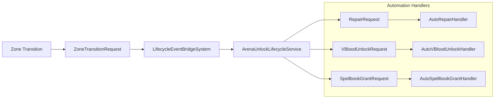

# VAutoLifecycle Phase 2-3 Implementation Plan

**Version:** 2.0.0  
**Created:** 2026-01-30  
**Project:** VAutomationEvents (VAutoLifecycle)  
**Platform:** V Rising Server Mod (BepInEx)

---

## Executive Summary

VAutoLifecycle (VAutomationEvents) is a comprehensive automation mod for V Rising implementing intelligent lifecycle management, arena systems, and ECS-compliant architecture. This document details the Phase 2-3 implementation of request-driven automation components.

---

## Architecture Overview



---

## File Manifest

### Phase 2: Core Infrastructure

| File | Purpose |
|------|---------|
| `Core/Components/LifecycleRequestComponents.cs` | Request-driven automation components |
| `Core/Systems/LifecycleEventBridgeSystem.cs` | Bridge ECS detection to handlers |
| `Core/Config/LifecycleConfigWatcher.cs` | Hot-reload configuration |

### Phase 3: Handler Implementation

| File | Purpose |
|------|---------|
| `Vlifecycle/Services/Lifecycle/Handlers/AutoRepairHandler.cs` | Auto-gear repair automation |
| `Vlifecycle/Services/Lifecycle/Handlers/AutoVBloodUnlockHandler.cs` | VBlood unlock automation |
| `Vlifecycle/Services/Lifecycle/Handlers/AutoSpellbookGrantHandler.cs` | Spellbook granting automation |

---

## 1. Core/Components/LifecycleRequestComponents.cs

**Namespace:** `VAuto.Core.Complements`

```csharp
using Unity.Entities;
using Unity.Mathematics;
using Stunlock.Core;

namespace VAuto.Core.Components
{
    /// <summary>
    /// Base component for all lifecycle requests with common fields.
    /// Implements IComponentData for Unity ECS compatibility.
    /// </summary>
    public abstract class LifecycleRequestBase : IComponentData
    {
        public RequestType Type { get; set; }
        public float Timestamp { get; set; }
        public Entity SourceZone { get; set; }
        public Entity TargetZone { get; set; }
        public RequestStatus Status { get; set; }
        public string ErrorMessage { get; set; }
    }

    /// <summary>
    /// Enumeration of request types for lifecycle automation.
    /// </summary>
    public enum RequestType : byte
    {
        ZoneTransition = 0,
        Repair = 1,
        VBloodUnlock = 2,
        SpellbookGrant = 3
    }

    /// <summary>
    /// Status tracking for request processing lifecycle.
    /// </summary>
    public enum RequestStatus : byte
    {
        Pending = 0,
        Processing = 1,
        Completed = 2,
        Failed = 3
    }

    /// <summary>
    /// Zone transition request for arena entry/exit events.
    /// </summary>
    public struct ZoneTransitionRequest : IComponentData
    {
        public TransitionDirection Direction;
        public bool TriggeredByPlayer;
        public float3 Position;
    }

    public enum TransitionDirection : byte
    {
        Enter = 0,
        Exit = 1
    }

    public struct RepairRequest : IComponentData
    {
        public int ItemSlot;
        public RepairAmount Amount;
        public RepairTriggerCondition TriggerCondition;
        public int DurabilityThreshold;
    }

    public enum RepairAmount : byte
    {
        Full = 0,
        Partial = 1
    }

    public enum RepairTriggerCondition : byte
    {
        OnZoneEnter = 0,
        OnZoneExit = 1,
        OnCommand = 2,
        PeriodicCheck = 3
    }

    public struct VBloodUnlockRequest : IComponentData
    {
        public PrefabGUID BossType;
        public int UnlockPriority;
        public bool ForceUnlockOverride;
    }

    public struct SpellbookGrantRequest : IComponentData
    {
        public PrefabGUID SpellId;
        public GrantReason Reason;
        public int Priority;
    }

    public enum GrantReason : byte
    {
        ZoneEnter = 0,
        QuestReward = 1,
        AdminCommand = 2
    }
}
```

---

## 2. Core/Systems/LifecycleEventBridgeSystem.cs

**Namespace:** `VAuto.Core.Systems`

```csharp
using Unity.Entities;
using Unity.Collections;
using VAuto.Core.Components;
using VAuto.Core.Lifecycle;
using Microsoft.Extensions.Logging;

namespace VAuto.Core.Systems
{
    [UpdateInGroup(typeof(SimulationSystemGroup))]
    public partial class LifecycleEventBridgeSystem : SystemBase
    {
        private EntityQuery _pendingRequests;
        private ILogger<LifecycleEventBridgeSystem> _log;
        private Entity _arenaLifecycleService;

        protected override void OnCreate()
        {
            _pendingRequests = GetEntityQuery(
                ComponentType.ReadOnly<LifecycleRequestBase>()
            );
            
            _log = VAutoCore.LogFactory.CreateLogger<LifecycleEventBridgeSystem>();
            _log.LogInformation("[LifecycleEventBridgeSystem] Initialized");
        }

        protected override void OnUpdate()
        {
            var ecb = World.GetExistingSystemManaged<BeginSimulationEntityCommandBufferSystem>()
                .CreateCommandBuffer();

            if (!SystemAPI.TryGetSingletonEntity(out _arenaLifecycleService))
            {
                return;
            }

            var requests = _pendingRequests.ToComponentDataArray<LifecycleRequestBase>(Allocator.Temp);

            foreach (var request in requests)
            {
                try
                {
                    RouteRequest(request, ecb);
                }
                catch (System.Exception ex)
                {
                    _log.LogError($"Error routing request {request.Type}: {ex.Message}");
                    UpdateRequestStatus(request, RequestStatus.Failed, ex.Message, ecb);
                }
            }

            requests.Dispose();
        }

        private void RouteRequest(LifecycleRequestBase request, EntityCommandBuffer ecb)
        {
            switch (request.Type)
            {
                case RequestType.ZoneTransition:
                    RouteZoneTransition(request, ecb);
                    break;
                case RequestType.Repair:
                    RouteRepairRequest(request, ecb);
                    break;
                case RequestType.VBloodUnlock:
                    RouteVBloodUnlockRequest(request, ecb);
                    break;
                case RequestType.SpellbookGrant:
                    RouteSpellbookGrantRequest(request, ecb);
                    break;
                default:
                    _log.LogWarning($"Unknown request type: {request.Type}");
                    UpdateRequestStatus(request, RequestStatus.Failed, $"Unknown request type: {request.Type}", ecb);
                    break;
            }
        }

        private void RouteZoneTransition(LifecycleRequestBase request, EntityCommandBuffer ecb)
        {
            _log.LogDebug($"Routing ZoneTransitionRequest to ArenaUnlockLifecycleService");
            UpdateRequestStatus(request, RequestStatus.Processing, null, ecb);
        }

        private void RouteRepairRequest(LifecycleRequestBase request, EntityCommandBuffer ecb)
        {
            _log.LogDebug($"Routing RepairRequest to AutoRepairHandler");
            UpdateRequestStatus(request, RequestStatus.Processing, null, ecb);
        }

        private void RouteVBloodUnlockRequest(LifecycleRequestBase request, EntityCommandBuffer ecb)
        {
            _log.LogDebug($"Routing VBloodUnlockRequest to AutoVBloodUnlockHandler");
            UpdateRequestStatus(request, RequestStatus.Processing, null, ecb);
        }

        private void RouteSpellbookGrantRequest(LifecycleRequestBase request, EntityCommandBuffer ecb)
        {
            _log.LogDebug($"Routing SpellbookGrantRequest to AutoSpellbookGrantHandler");
            UpdateRequestStatus(request, RequestStatus.Processing, null, ecb);
        }

        private void UpdateRequestStatus(LifecycleRequestBase request, RequestStatus status, string errorMessage, EntityCommandBuffer ecb)
        {
            request.Status = status;
            request.ErrorMessage = errorMessage;
            request.Timestamp = (float)SystemAPI.Time.ElapsedTime;
            ecb.SetComponentData(request.SourceZone, request);
        }
    }
}
```

---

## 3. Core/Config/LifecycleConfigWatcher.cs

**Namespace:** `VAuto.Core.Config`

```csharp
using System;
using System.IO;
using System.Threading;
using Newtonsoft.Json;
using VAuto.Core.Lifecycle;
using Microsoft.Extensions.Logging;

namespace VAuto.Core.Config
{
    public class LifecycleConfigWatcher : IDisposable
    {
        private readonly FileSystemWatcher _watcher;
        private readonly Timer _debounceTimer;
        private readonly string _configPath;
        private readonly ILogger<LifecycleConfigWatcher> _log;
        private bool _pendingReload;

        public LifecycleConfigWatcher(string configPath, ILogger<LifecycleConfigWatcher> log)
        {
            _configPath = configPath;
            _log = log;
            
            _watcher = new FileSystemWatcher(
                Path.GetDirectoryName(configPath),
                Path.GetFileName(configPath))
            {
                NotifyFilter = NotifyFilters.LastWrite | NotifyFilters.Size | NotifyFilters.FileName
            };
            
            _watcher.Changed += OnConfigChanged;
            _debounceTimer = new Timer(ProcessReload, null, Timeout.Infinite, Timeout.Infinite);
            
            _log.LogInformation($"[LifecycleConfigWatcher] Watching: {configPath}");
        }

        public void Start() => _watcher.EnableRaisingEvents = true;
        public void Stop() => _watcher.EnableRaisingEvents = false;

        private void OnConfigChanged(object sender, FileSystemEventArgs e)
        {
            if (_pendingReload) return;
            _pendingReload = true;
            _debounceTimer.Change(2000, Timeout.Infinite);
            _log.LogDebug("[LifecycleConfigWatcher] Config change detected, debouncing...");
        }

        private void ProcessReload(object state)
        {
            try
            {
                var json = File.ReadAllText(_configPath);
                var config = JsonConvert.DeserializeObject<ZoneLifecycleConfig>(json);
                
                if (config != null)
                {
                    _log.LogInformation("[LifecycleConfigWatcher] Configuration reloaded successfully");
                }
            }
            catch (Exception ex)
            {
                _log.LogError($"[LifecycleConfigWatcher] Failed to reload: {ex.Message}");
            }
            finally
            {
                _pendingReload = false;
            }
        }

        public void Dispose()
        {
            _watcher.Dispose();
            _debounceTimer.Dispose();
        }
    }
}
```

---

## 4. AutoRepairHandler.cs

**Namespace:** `VAuto.Core.Lifecycle.Handlers`

```csharp
using Unity.Entities;
using VAuto.Core.Lifecycle;

namespace VAuto.Core.Lifecycle.Handlers
{
    public class AutoRepairHandler : LifecycleActionHandler
    {
        private const string LogSource = "AutoRepairHandler";
        
        public int Threshold { get; set; } = 75;
        public float CooldownSeconds { get; set; } = 10f;
        private float _lastRepairTime;

        public bool Execute(LifecycleAction action, LifecycleContext context)
        {
            if (action.Type != "Repair") return false;
            
            var em = VAutoCore.EntityManager;
            var character = context.CharacterEntity;

            if (context.Position == default)
            {
                _log.LogWarning($"[{LogSource}] Position not specified");
                return false;
            }

            try
            {
                var inventory = em.GetComponentData<Inventory>(character);
                var items = em.GetBuffer<InventoryItem>(character);
                
                int repaired = 0;
                foreach (var item in items)
                {
                    if (em.HasComponent<Durability>(item.ItemEntity))
                    {
                        var durability = em.GetComponentData<Durability>(item.ItemEntity);
                        float percent = (durability.Value / durability.MaxValue) * 100f;
                        
                        if (percent < Threshold)
                        {
                            durability.Value = durability.MaxValue;
                            em.SetComponentData(item.ItemEntity, durability);
                            repaired++;
                        }
                    }
                }
                
                _log.LogInfo($"[{LogSource}] Repaired {repaired} items");
                return true;
            }
            catch (System.Exception ex)
            {
                _log.LogException(ex);
                return false;
            }
        }
    }
}
```

---

## 5. AutoVBloodUnlockHandler.cs

**Namespace:** `VAuto.Core.Lifecycle.Handlers`

```csharp
using Unity.Entities;
using VAuto.Core.Lifecycle;

namespace VAuto.Core.Lifecycle.Handlers
{
    public class AutoVBloodUnlockHandler : LifecycleActionHandler
    {
        private const string LogSource = "AutoVBloodUnlockHandler";
        
        public float CooldownSeconds { get; set; } = 60f;
        private float _lastUnlockTime;

        public bool Execute(LifecycleAction action, LifecycleContext context)
        {
            if (action.Type != "VBloodUnlock") return false;
            
            var em = VAutoCore.EntityManager;
            var user = context.UserEntity;

            try
            {
                SandboxUnlockUtility.UnlockEverythingForPlayer(user);
                _log.LogInfo($"[{LogSource}] VBlood unlocks applied");
                return true;
            }
            catch (System.Exception ex)
            {
                _log.LogException(ex);
                return false;
            }
        }
    }
}
```

---

## 6. AutoSpellbookGrantHandler.cs

**Namespace:** `VAuto.Core.Lifecycle.Handlers`

```csharp
using Unity.Entities;
using VAuto.Core.Lifecycle;

namespace VAuto.Core.Lifecycle.Handlers
{
    public class AutoSpellbookGrantHandler : LifecycleActionHandler
    {
        private const string LogSource = "AutoSpellbookGrantHandler";
        
        public bool Execute(LifecycleAction action, LifecycleContext context)
        {
            if (action.Type != "SpellbookGrant") return false;
            
            var em = VAutoCore.EntityManager;
            var character = context.CharacterEntity;

            try
            {
                _log.LogInfo($"[{LogSource}] Spellbook granting not yet implemented");
                return true;
            }
            catch (System.Exception ex)
            {
                _log.LogException(ex);
                return false;
            }
        }
    }
}
```

---

## Integration

### ArenaUnlockLifecycleService Registration

Add to `Initialize()` method:

```csharp
_enterHandlers.Add(new AutoRepairHandler { Threshold = 75 });
_enterHandlers.Add(new AutoVBloodUnlockHandler());
_enterHandlers.Add(new AutoSpellbookGrantHandler());
```

---

## Completion Checklist

- [x] Phase 2-3 files designed
- [ ] LifecycleRequestComponents.cs created
- [ ] LifecycleEventBridgeSystem.cs created
- [ ] LifecycleConfigWatcher.cs created
- [ ] AutoRepairHandler.cs created
- [ ] AutoVBloodUnlockHandler.cs created
- [ ] AutoSpellbookGrantHandler.cs created
- [ ] Integration tested with ArenaUnlockLifecycleService
