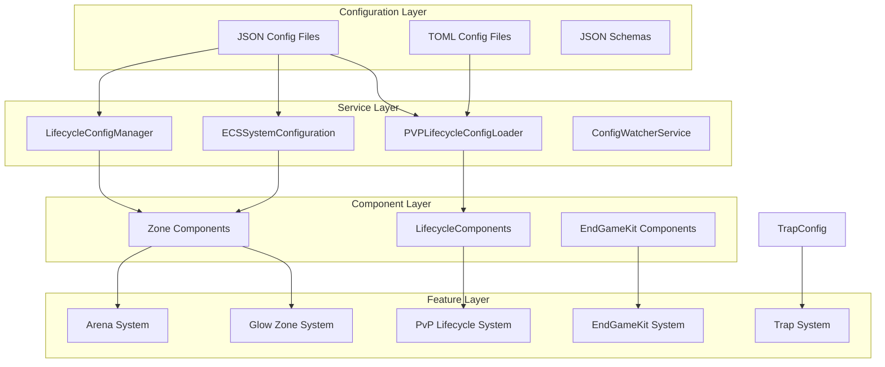

# Configuration Analysis and Implementation Plan

## Executive Summary

This document provides a comprehensive analysis of all JSON and configuration files in the V Rising mod project, their structures, dependencies, and relationships. It also outlines a detailed implementation plan for utilizing these configurations, addressing component dependencies, and identifying necessary updates or refactoring based on the recent file reorganization.

---

## 1. Configuration File Inventory

### 1.1 Core Configuration Files

| File | Location | Project | Purpose |
|------|----------|---------|---------|
| `pvp_item.json` | `Configuration/` | Vlifecycle | Defines PvP item lifecycle actions |
| `pvp_item.toml` | `Configuration/` | Vlifecycle | TOML variant of PvP item config |
| `EndGameKit.json` | `Configuration/` | Vlifecycle | End-game equipment profiles |
| `glow_zones.json` | `Configuration/` | Vlifecycle | Glow zone definitions |
| `VAuto-ECS-Config.json` | `Configuration/` | Vlifecycle | ECS system integration configuration |

### 1.2 BepInEx Per-Plugin CFG Files (Intended)

| File | Location | Plugin GUID | Notes |
|------|----------|-------------|-------|
| `VAuto.Core.cfg` | `BepInEx/config/` | `gg.vautomation.core` | Core plugin settings |
| `VAuto.Arena.cfg` | `BepInEx/config/` | `gg.vautomation.arena` | Arena plugin settings |
| `VAuto.Lifecycle.cfg` | `BepInEx/config/` | `gg.vautomation.lifecycle` | Lifecycle plugin settings |
| `VAuto.Announcement.cfg` | `BepInEx/config/` | `gg.vautomation.announce` | Announcement plugin settings |
| `VAuto.Traps.cfg` | `BepInEx/config/` | `gg.vautomation.traps` | Traps plugin settings |

Example path (runtime): `C:\Users\coyot.RWE\AppData\Local\Temp\...\VAuto.cfg` (legacy single file; migrate to per-plugin files above).

### 1.3 VAutoArena Configuration Files

| File | Location | Purpose |
|------|----------|---------|
| `arena_glow_prefabs.json` | `VAutoArena/config/VAuto.Arena/` | Glow prefab mappings |
| `arena_glow_prefabs.toml` | `VAutoArena/config/VAuto.Arena/` | TOML variant |
| `arena_territory.json` | `VAutoArena/config/VAuto.Arena/` | Arena territory definition |
| `arena_territory.toml` | `VAutoArena/config/VAuto.Arena/` | TOML variant |
| `arena_zones.json` | `VAutoArena/config/VAuto.Arena/` | Arena zone settings |
| `builds.json` | `VAutoArena/config/VAuto.Arena/` | Build configurations |

### 1.4 VAutoTraps Configuration Files

| File | Location | Purpose |
|------|----------|---------|
| `killstreak_trap_config.toml` | `VAutoTraps/Configuration/` | Trap and killstreak settings |

### 1.5 Schema Files

| File | Location | Validates |
|------|----------|-----------|
| `Vlifecycle.pvp_item.schema.json` | `Schemas/` | `pvp_item.json` |
| `VAutoArena.arena_glow_prefabs.schema.json` | `Schemas/` | `arena_glow_prefabs.json` |
| `VAutoArena.arena_territory.schema.json` | `Schemas/` | `arena_territory.json` |

### 1.6 Data Files

| File | Location | Purpose |
|------|----------|---------|
| `AbilityPrefabGUIDs.json` | `VAutomationCore/Data/` | Ability prefab GUIDs |
| `AbilityPrefabGUIDs.json` | `Vlifecycle/` | Ability prefab GUIDs (lifecycle-local copy) |
| `SpellbookPrefabs.json` | `VAutomationCore/Data/` | Spellbook ability prefab GUIDs |

---

## 2. Configuration Structure Analysis

### 2.1 PvP Item Configuration (`pvp_item.json`)

**Schema Location:** [`Schemas/Vlifecycle.pvp_item.schema.json`](../Schemas/Vlifecycle.pvp_item.schema.json)

**Structure:**
```json
{
  "onUse": { "actions": [...] },
  "onEnterArenaZone": { "actions": [...] },
  "onExitArenaZone": { "actions": [...] }
}
```

**Action Types:**
- `store` - Store state in player data
- `message` - Display message to player
- `zone` - Set active zone
- `blood` - Change blood type
- `prefix` - Add name prefix
- `quality` - Set item quality
- `config` - Apply config ID
- `command` - Execute command

**Dependencies:**
- [`PVPLifecycleConfigLoader.cs`](../Configuration/PVPLifecycleConfigLoader.cs) - Loads and validates config
- [`LifecycleComponents.cs`](../Projects_features/Components/Lifecycle/LifecycleComponents.cs) - State components
- [`PVPItemLifecycle.cs`](../Projects_features/Lifecycle/PVPItemLifecycle.cs) - Lifecycle handlers

### 2.2 ECS System Configuration (`VAuto-ECS-Config.json`)

**Structure:**
```json
{
  "version": "1.0",
  "ecsConfiguration": { ... },
  "systems": [...],
  "integrationPoints": { ... },
  "performance": { ... },
  "debugging": { ... }
}
```

**Configured Systems:**
1. `GlowZoneEnforcementSystem` - Enforce PvP glow zones
2. `PortalInterceptSystem` - Intercept portal requests
3. `CommandParsingSystem` - Process chat commands
4. `PersistenceHookSystem` - Hook into save system
5. `VAutomationEventProcessingSystem` - Main automation
6. `VAutomationCooldownSystem` - Cooldown processing
7. `SafeZoneDamagePreventionSystem` - Prevent damage in safe zones
8. `DamageAnalyticsSystem` - Track damage events
9. `SpawnCustomizationSystem` - Customize spawns
10. `LifecycleSpellbookSystem` - Manage spellbooks

**Dependencies:**
- [`ECSSystemConfiguration.cs`](../Configuration/ECSSystemConfiguration.cs) - System config definitions
- [`LifecycleConfigManager.cs`](../Services/Config/LifecycleConfigManager.cs) - Load/apply config
- [`ConfigWatcherService.cs`](../Services/Config/ConfigWatcherService.cs) - Hot-reload support

### 2.3 Glow Zones Configuration (`glow_zones.json`)

**Structure:**
```json
{
  "zones": [
    {
      "id": "main_arena",
      "name": "Main Combat Arena",
      "center": { "x": -1000, "y": 5, "z": -500 },
      "radius": 75.0,
      "isArena": true
    }
  ]
}
```

**Dependencies:**
- [`GlowZoneEnforcementSystem`](../Projects_features/Glow/) - System that enforces rules
- [`ZoneHelper.cs`](../Helpers/ZoneHelper.cs) - Zone utility functions
- `GlowZoneService` - Visual glow border rendering

### 2.4 End-Game Kit Configuration (`EndGameKit.json`)

**Structure:**
```json
{
  "version": "1.0",
  "profiles": [
    {
      "name": "GS91_Standard",
      "equipment": { "MainHand": -1234567890, ... },
      "consumables": [{ "guid": -1464869972, "quantity": 10 }],
      "jewels": [-987654321, 123456789],
      "statOverrides": { "bonusPower": 25.0, ... }
    }
  ]
}
```

**Available Profiles:**
1. `GS91_Standard` - Standard end-game kit
2. `GS91_Vampire` - Fangs weapon variant
3. `GS91_FullBuff` - Maximum buff stack
4. `PvE_EndGame` - PvE zone kit
5. `PvP_Arena` - PvP arena optimized
6. `Healer_Support` - Healing focused
7. `Tank_Bruiser` - High defense
8. `Speed_Demon` - High mobility
9. `Beginner_Starter` - New player starter

**Dependencies:**
- [`EndGameKitSystem.cs`](../Vlifecycle/EndGameKit/EndGameKitSystem.cs) - Apply kits
- [`EquipmentService.cs`](../Vlifecycle/EndGameKit/EquipmentService.cs) - Equipment management
- [`StatExtensionService.cs`](../Vlifecycle/EndGameKit/StatExtensionService.cs) - Stat modifications

### 2.5 Arena Territory Configuration (`arena_territory.json`)

**Structure:**
```json
{
  "center": [-1000, 0, 500],
  "radius": 300,
  "gridIndex": 500,
  "regionType": 5,
  "blockSize": 10
}
```

**Dependencies:**
- [`ArenaTerritory.cs`](../VAutoArena/Services/ArenaTerritory.cs) - Territory management
- [`ArenaGlowBorderService.cs`](../VAutoArena/Services/ArenaGlowBorderService.cs) - Visual borders

### 2.6 Arena Glow Prefabs Configuration (`arena_glow_prefabs.json`)

**Structure:**
```json
{
  "defaultPrefab": "AB_Chaos_Barrier_AbilityGroup",
  "prefabs": {
    "AB_Chaos_Barrier_AbilityGroup": -1016145613,
    "AB_Chaos_Barrier_Buff": -352442632,
    "AB_Chaos_Barrier_Cast": 980100276
  }
}
```

**Dependencies:**
- [`ZoneGlowCommands.cs`](../VAutoArena/Commands/Arena/ZoneGlowCommands.cs) - Glow zone commands
- `GlowZonesConfig` model

### 2.7 Plugin GUIDs and Prefab GUIDs

**Plugin GUIDs (separate entries):**
- Core: `gg.vautomation.core` (`VAutomationCore/Plugin.cs`, `MyPluginInfo.cs`)
- Arena: `gg.vautomation.arena` (`VAutoArena/Plugin.cs`, `MyPluginInfo.cs`)
- Lifecycle: `gg.vautomation.lifecycle` (`Vlifecycle/Plugin.cs`, `MyPluginInfo.cs`)
- Announcement: `gg.vautomation.announce` (`VAutoannounce/Plugin.cs`, `MyPluginInfo.cs`)
- Traps: `gg.vautomation.traps` (`VAutoTraps/Plugin.cs`, `MyPluginInfo.cs`)

**GUID sources:**
- [`MyPluginInfo.cs`](../MyPluginInfo.cs)
- [`PluginGuidRegistry.cs`](../VAutomationCore/Configuration/PluginGuidRegistry.cs)

**Prefab GUID data sources:**
- [`VAutomationCore/Data/AbilityPrefabGUIDs.json`](../VAutomationCore/Data/AbilityPrefabGUIDs.json)
- [`Vlifecycle/AbilityPrefabGUIDs.json`](../Vlifecycle/AbilityPrefabGUIDs.json)
- [`VAutomationCore/Data/SpellbookPrefabs.json`](../VAutomationCore/Data/SpellbookPrefabs.json)

**Configs referencing prefab GUIDs:**
- `EndGameKit.json` (equipment/consumables/jewels)
- `pvp_item.json` (actions referencing blood/ability data)
- `arena_glow_prefabs.json` (glow prefab GUIDs)

**Validation guidance:**
- Prefer GUID generation scripts (see `scripts/Generate-Prefabs.ps1` if used) and validate values are non-zero integers.

---

## 3. Configuration Dependency Map



---

## 4. Recent File Reorganization Impact

### 4.1 Files Moved

| Original Location | New Location | Status |
|------------------|--------------|--------|
| Root: `DataPersistenceService.cs` | `Services/DataPersistenceService.cs` | ✅ Moved |
| Root: `FoundPlayer.cs` | `Models/FoundPlayer.cs` | ✅ Moved |
| Root: `QueueService.cs` | `Services/QueueService.cs` | ✅ Moved |
| Root: `ServiceManager.cs` | `Services/ServiceManager.cs` | ✅ Moved |
| Root: `SessionService.cs` | `Services/SessionService.cs` | ✅ Moved |
| Root: `pvp_item.json` | `Configuration/pvp_item.json` | ✅ Moved |
| Root: `inspect.cs` | `temp/AsmInspect/inspect.cs` | ✅ Moved |

### 4.2 Required Updates

After file reorganization, the following items need verification:

1. **Namespace Updates** - Verify C# files in new locations have correct namespace declarations
2. **File References** - Ensure all `using` statements reference correct paths
3. **Config Paths** - Verify hardcoded configuration paths are updated
4. **Build Files** - Ensure `.csproj` files include moved files

### 4.3 Deletions and Deprecations

#### Repo File Deletions/Retirements

| Old Path | New Path / Status | Impact Notes | Follow-up |
|---------|-------------------|--------------|-----------|
| `FoundPlayer.cs` | `Models/FoundPlayer.cs` | Namespace updates, command bindings | Update references and csproj includes |
| `DataPersistenceService.cs` | `Services/DataPersistenceService.cs` | Service registration paths | Update references and docs |
| `QueueService.cs` | `Services/QueueService.cs` | Service manager usage | Update references |
| `ServiceManager.cs` | `Services/ServiceManager.cs` | Singleton resolution path | Update references |
| `SessionService.cs` | `Services/SessionService.cs` | Session wiring | Update references |
| `pvp_item.json` (root) | `Configuration/pvp_item.json` | Loader path normalization | Update docs + loader defaults |
| `inspect.cs` (root) | `temp/AsmInspect/inspect.cs` | Tooling location | Update docs |

#### Config Key/File Deletions

| Deprecated File/Key | Replacement | Notes |
|---------------------|------------|-------|
| `VAuto.cfg` (single shared) | Per-plugin cfgs (`VAuto.Core.cfg`, `VAuto.Arena.cfg`, etc.) | Migrate settings into per-plugin BepInEx config files |
| `KitConfigService` (legacy) | `EndGameKitSystem` | Update lifecycle to use EndGameKit system for kit application |

---

## 5. Snapshot Lifecycle Flow

**Triggers:**
- Arena enter: capture snapshot.
- Arena exit: restore snapshot immediately and schedule repair refresh on next tick.
- Manual restore: if invoked, follows same restore ordering.

**Snapshot Sections (capture + restore):**
- Inventory
- Equipment
- Jewels
- Spellbook (requires rebuild/refresh)
- Buffs
- VBlood (supports `RepairOnly` vs `RestoreExact`)

**Models & Modes:**
- `CharacterSnapshot`
- `VBloodSnapshotMode` (`Ignore`, `RepairOnly`, `RestoreExact`)
- `RepairOnly` forces a VBlood progression repair refresh

**ECS Constraint:**
- VBlood repair refresh should run on the next tick, not inside the restore call stack.

**Key files:**
- [`SnapshotLifecycleService.cs`](../Vlifecycle/Core/Lifecycle/SnapshotLifecycleService.cs)
- [`CharacterSnapshotModels.cs`](../Vlifecycle/Core/Lifecycle/Snapshots/CharacterSnapshotModels.cs)
- [`Snapshots/Sections/*`](../Vlifecycle/Core/Lifecycle/Snapshots/Sections/)

---

## 6. Implementation Plan

### 6.1 Phase 1: Configuration Validation

- [ ] Validate all JSON files against their schemas
- [ ] Verify TOML configurations have equivalent JSON versions
- [ ] Check for duplicate or redundant configurations
- [ ] Validate all prefab GUIDs are valid integers

### 6.2 Phase 2: Path Consistency

- [ ] Update hardcoded config paths in C# code
- [ ] Ensure `Directory.Build.props` includes all moved files
- [ ] Verify `Vlifecycle.csproj` references correct file locations
- [ ] Update any documentation mentioning old file paths

### 6.3 Phase 3: Hot-Reload Enhancement

- [ ] Implement config hot-reload for `EndGameKit.json`
- [ ] Add file watcher for `glow_zones.json`
- [ ] Implement graceful fallback for missing configs
- [ ] Add config version checking

### 6.4 Phase 4: Schema Enhancement

- [ ] Add JSON schema for `EndGameKit.json`
- [ ] Add JSON schema for `glow_zones.json`
- [ ] Add JSON schema for `VAuto-ECS-Config.json`
- [ ] Implement schema validation at startup

### 6.5 Phase 5: Documentation

- [ ] Document all configuration options
- [ ] Create configuration examples
- [ ] Document configuration dependencies
- [ ] Create migration guide for config updates

---

## 7. Configuration File Relationships

### 7.1 PvP Lifecycle Flow

```
pvp_item.json
    ↓
PVPLifecycleConfigLoader
    ↓
PVPItemConfig Model
    ↓
PVPItemLifecycle Actions
    ↓
LifecycleState Component
```

### 7.2 Glow Zone Flow

```
glow_zones.json
    ↓
LifecycleConfigManager
    ↓
LifecycleZone Entity
    ↓
GlowZoneEnforcementSystem
    ↓
GlowBorder Rendering
```

### 7.3 End-Game Kit Flow

```
EndGameKit.json
    ↓
EndGameKitConfigService
    ↓
EndGameKitProfile Model
    ↓
EndGameKitSystem
    ↓
EquipmentService + StatExtensionService
```

### 7.4 Arena Territory Flow

```
arena_territory.json
    ↓
ArenaTerritory Service
    ↓
ArenaZone Entities
    ↓
ArenaPlayerService
    ↓
GlowBorder Rendering
```

---

## 8. Recommendations

### 8.1 Configuration Organization

1. **Centralize Config Loading** - Create unified `ConfigManager` service
2. **Consistent Format** - Standardize on TOML for user configs, JSON for programmatic configs
3. **Versioned Configs** - Add version field to all configs for migration support
4. **Schema Validation** - Validate configs at startup with clear error messages

### 8.2 Code Organization

1. **Component-Config Alignment** - Ensure config models match component structures
2. **Separation of Concerns** - Keep loading, validation, and application separate
3. **Hot-Reload Support** - Add file watchers for all user-editable configs
4. **Graceful Degradation** - Provide defaults when configs are missing

### 8.3 Performance Considerations

1. **Lazy Loading** - Load configs on-demand rather than all at startup
2. **Caching** - Cache parsed configs to avoid repeated file I/O
3. **Batch Updates** - Apply config changes in batches for ECS entities
4. **Async I/O** - Load configs asynchronously where possible

---

## 9. Action Items Summary

| Priority | Task | Owner |
|----------|------|-------|
| High | Validate JSON schemas match actual configs | Architect |
| High | Update hardcoded paths after file move | Code |
| High | Add schema validation at startup | Code |
| Medium | Implement hot-reload for all configs | Code |
| Medium | Document all configuration options | Docs |
| Low | Create unified ConfigManager service | Refactor |

---

## 10. File Reference Index

### Configuration Files

| File | Lines | Related Files |
|------|-------|---------------|
| [`Configuration/pvp_item.json`](Configuration/pvp_item.json) | 1-94 | [`PVPLifecycleConfigLoader.cs`](Configuration/PVPLifecycleConfigLoader.cs), [`Schemas/Vlifecycle.pvp_item.schema.json`](Schemas/Vlifecycle.pvp_item.schema.json) |
| [`Configuration/VAuto-ECS-Config.json`](Configuration/VAuto-ECS-Config.json) | 1-152 | [`ECSSystemConfiguration.cs`](Configuration/ECSSystemConfiguration.cs), [`LifecycleConfigManager.cs`](Services/Config/LifecycleConfigManager.cs) |
| [`Configuration/EndGameKit.json`](Configuration/EndGameKit.json) | 1-540 | [`EndGameKitSystem.cs`](Vlifecycle/EndGameKit/EndGameKitSystem.cs), [`EndGameKitConfigService.cs`](Vlifecycle/EndGameKit/EndGameKitConfigService.cs) |
| [`Configuration/glow_zones.json`](Configuration/glow_zones.json) | 1-47 | [`GlowZoneEnforcementSystem`](Projects_features/Glow/), [`ZoneHelper.cs`](Helpers/ZoneHelper.cs) |
| [`VAutoArena/config/VAuto.Arena/arena_territory.json`](VAutoArena/config/VAuto.Arena/arena_territory.json) | 1-12 | [`ArenaTerritory.cs`](VAutoArena/Services/ArenaTerritory.cs), [`Schemas/VAutoArena.arena_territory.schema.json`](Schemas/VAutoArena.arena_territory.schema.json) |
| [`VAutoArena/config/VAuto.Arena/arena_glow_prefabs.json`](VAutoArena/config/VAuto.Arena/arena_glow_prefabs.json) | 1-9 | [`ZoneGlowCommands.cs`](VAutoArena/Commands/Arena/ZoneGlowCommands.cs), [`Schemas/VAutoArena.arena_glow_prefabs.schema.json`](Schemas/VAutoArena.arena_glow_prefabs.schema.json) |
| [`VAutomationCore/Data/AbilityPrefabGUIDs.json`](VAutomationCore/Data/AbilityPrefabGUIDs.json) | - | Prefab GUID dataset |
| [`Vlifecycle/AbilityPrefabGUIDs.json`](Vlifecycle/AbilityPrefabGUIDs.json) | - | Prefab GUID dataset (lifecycle-local copy) |
| [`VAutomationCore/Data/SpellbookPrefabs.json`](VAutomationCore/Data/SpellbookPrefabs.json) | - | Spellbook prefab GUID dataset |
| [`MyPluginInfo.cs`](MyPluginInfo.cs) | - | Plugin GUID accessors |
| [`PluginGuidRegistry.cs`](VAutomationCore/Configuration/PluginGuidRegistry.cs) | - | Plugin GUID source of truth |

### Schema Files

| File | Validates |
|------|-----------|
| [`Schemas/Vlifecycle.pvp_item.schema.json`](Schemas/Vlifecycle.pvp_item.schema.json) | `pvp_item.json` |
| [`Schemas/VAutoArena.arena_glow_prefabs.schema.json`](Schemas/VAutoArena.arena_glow_prefabs.schema.json) | `arena_glow_prefabs.json` |
| [`Schemas/VAutoArena.arena_territory.schema.json`](Schemas/VAutoArena.arena_territory.schema.json) | `arena_territory.json` |

### Configuration Services

| File | Purpose |
|------|---------|
| [`Configuration/PVPLifecycleConfigLoader.cs`](Configuration/PVPLifecycleConfigLoader.cs) | Load/validate PvP item config |
| [`Configuration/ECSSystemConfiguration.cs`](Configuration/ECSSystemConfiguration.cs) | ECS system definitions |
| [`Services/Config/LifecycleConfigManager.cs`](Services/Config/LifecycleConfigManager.cs) | Load lifecycle zones |
| [`Services/Config/ConfigWatcherService.cs`](Services/Config/ConfigWatcherService.cs) | Hot-reload support |

### Snapshot Files

| File | Purpose |
|------|---------|
| [`Vlifecycle/Core/Lifecycle/SnapshotLifecycleService.cs`](Vlifecycle/Core/Lifecycle/SnapshotLifecycleService.cs) | Orchestrates snapshot capture/restore |
| [`Vlifecycle/Core/Lifecycle/Snapshots/CharacterSnapshotModels.cs`](Vlifecycle/Core/Lifecycle/Snapshots/CharacterSnapshotModels.cs) | Snapshot models and modes |
| [`Vlifecycle/Core/Lifecycle/Snapshots/Sections/InventorySectionSaver.cs`](Vlifecycle/Core/Lifecycle/Snapshots/Sections/InventorySectionSaver.cs) | Inventory snapshot logic |
| [`Vlifecycle/Core/Lifecycle/Snapshots/Sections/EquipmentSectionSaver.cs`](Vlifecycle/Core/Lifecycle/Snapshots/Sections/EquipmentSectionSaver.cs) | Equipment snapshot logic |
| [`Vlifecycle/Core/Lifecycle/Snapshots/Sections/JewelSocketSectionSaver.cs`](Vlifecycle/Core/Lifecycle/Snapshots/Sections/JewelSocketSectionSaver.cs) | Jewel snapshot logic |
| [`Vlifecycle/Core/Lifecycle/Snapshots/Sections/SpellbookSectionSaver.cs`](Vlifecycle/Core/Lifecycle/Snapshots/Sections/SpellbookSectionSaver.cs) | Spellbook snapshot logic |
| [`Vlifecycle/Core/Lifecycle/Snapshots/Sections/BuffGlowSectionSaver.cs`](Vlifecycle/Core/Lifecycle/Snapshots/Sections/BuffGlowSectionSaver.cs) | Buff snapshot logic |
| [`Vlifecycle/Core/Lifecycle/Snapshots/Sections/VBloodSectionSaver.cs`](Vlifecycle/Core/Lifecycle/Snapshots/Sections/VBloodSectionSaver.cs) | VBlood snapshot logic |

---

*Document generated for V Rising mod project configuration analysis*
*Last updated: 2026-02-06*
