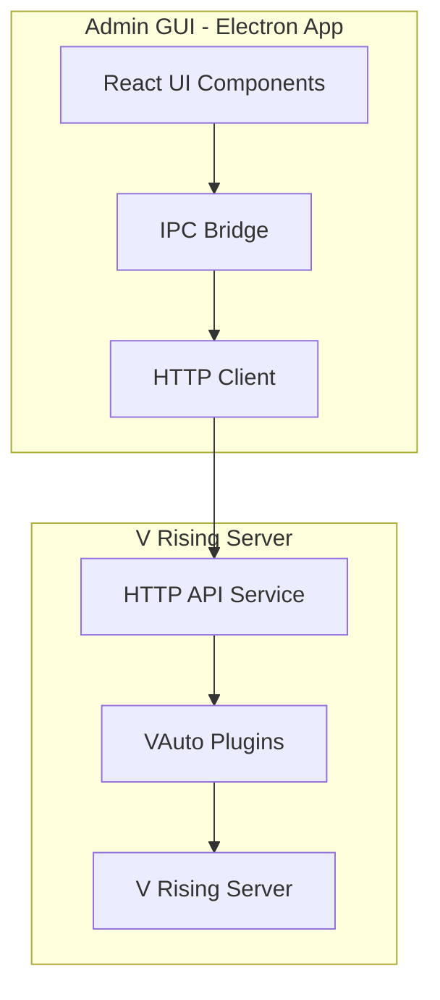

# V Rising Admin GUI Tool - Architecture Plan

## Overview

Build an Electron-based desktop application that provides a visual interface for managing V Rising server automation plugins (VAutoZone, VAutoTraps, VAutomationCore).

## Architecture Diagram



## Technology Stack

| Layer | Technology | Purpose |
|-------|------------|---------|
| Desktop Framework | Electron 28+ | Cross-platform desktop app |
| UI Framework | React 18 + TypeScript | Component-based UI |
| Styling | Goober CSS-in-JS | Dark theme patterns from game-tools |
| Build Tool | Vite + Electron Builder | Fast build & packaging |
| State Management | Zustand | Lightweight state |
| Communication | HTTP + WebSocket | Server-GUI communication |

## UI Component Library (From game-tools Patterns)

Based on reusable patterns from the MUD game-tools EntityInspector:

### Styled Components (src/components/StyledComponents.ts)
```typescript
// Dark theme styled components
- BrowserContainer    // Main container (dark bg: rgba(0,0,0,0.2))
- ComponentBrowserInput  // Input fields (bg: #383c4a, text: #8c91a0)
- ComponentBrowserButton  // Buttons with active state
- ComponentBrowserSelect   // Dropdown selects
- Collapse         // Expandable/collapsible sections
- SmallHeadline    // Section headers
```

### Color Theme (Dark Mode)
```css
--bg-primary: #1a1a2e
--bg-secondary: #16213e
--bg-tertiary: #383c4a
--text-primary: #ffffff
--text-secondary: #8c91a0
--accent: #4a9eff
--success: #00ff88
--warning: #ffaa00
--error: #ff4444
```

## Project Structure

```
VRisingAdminTools/
├── src/
│   ├── main/                 # Electron main process
│   │   ├── main.ts           # App entry point
│   │   ├── ipcHandler.ts     # IPC communication bridge
│   │   └── tray.ts           # System tray integration
│   ├── preload/              # Preload scripts
│   ├── renderer/             # React UI
│   │   ├── components/       # Reusable UI components
│   │   │   ├── StyledComponents.ts  # From game-tools patterns
│   │   │   ├── StatusCard.tsx       # Server status card
│   │   │   ├── ActionButton.tsx     # Admin action buttons
│   │   │   ├── DataTable.tsx        # Table with sorting/filtering
│   │   │   ├── EventLog.tsx         # Real-time event viewer
│   │   │   └── Collapse.tsx         # Expandable sections
│   │   ├── pages/           # Main pages
│   │   │   ├── Dashboard.tsx
│   │   │   ├── ZoneManagement.tsx
│   │   │   ├── TrapSystem.tsx
│   │   │   ├── Configuration.tsx
│   │   │   └── Logs.tsx
│   │   ├── hooks/           # Custom React hooks
│   │   │   ├── useApi.ts            # API communication
│   │   │   ├── useWebSocket.ts      # Real-time updates
│   │   │   └── useAuth.ts           # Authentication
│   │   ├── services/        # API services
│   │   │   ├── api.ts        # HTTP client (axios)
│   │   │   └── websocket.ts  # WebSocket client
│   │   ├── stores/          # State stores
│   │   │   └── useStore.ts  # Zustand store
│   │   └── utils/           # Utilities
│   │       └── formatters.ts
│   └── shared/              # Shared types
│       └── types.ts         # TypeScript interfaces
├── server/                  # V Rising plugin API
│   ├── HttpServer.cs        # HTTP server implementation
│   ├── Controllers/
│   │   ├── StatusController.cs
│   │   ├── ZoneController.cs
│   │   ├── TrapController.cs
│   │   └── ConfigController.cs
│   └── Models/
│       └── ApiModels.cs
└── package.json
```

## Core Features

### 1. Dashboard Overview
- **Server Status Card** - Online/offline, player count, uptime
- **Quick Actions Toolbar** - One-click frequently used commands
- **Recent Events Feed** - Live event stream with filtering (pattern from EntityInspector)

### 2. Zone Management (VAutoZone Integration)

**UI Components:**
- `ZoneListPanel.tsx` - List all zones with status
- `ZoneCard.tsx` - Individual zone with border/glow controls
- `GlowBorderViewer.tsx` - Visual representation of borders
- `ZoneConfigForm.tsx` - Inline config editing

**Features (from VAutoZoneCommands.cs):**
- Toggle glow borders on/off
- Spawn/clear all glows
- Adjust glow spacing (slider)
- Select glow prefab (dropdown)
- Toggle corner spawns
- Reload configuration

### 3. Trap System (VAutoTraps Integration)

**UI Components:**
- `TrapDashboard.tsx` - Main trap overview
- `TrapList.tsx` - All traps with status (ARMED/DISARMED/TRIGGERED)
- `TrapZoneEditor.tsx` - Create/manage trap zones
- `ChestSpawner.tsx` - Chest spawning interface
- `KillStreakPanel.tsx` - Kill streak leaderboard

**Features (from TrapCommands.cs):**
- List all traps
- Arm/disarm individual traps
- Test trigger trap
- Create/delete trap zones
- Spawn chests (Normal/Rare/Epic/Legendary)
- List/remove spawned chests
- View/reset kill streaks

### 4. Configuration Editor
- Live TOML/JSON editor with syntax highlighting
- Config validation before save
- Version history with rollback
- Export/import configurations

### 5. Real-time Logs & Events
- Filterable event log (pattern from EntityInspector history)
- Search and highlight
- Export to JSON/CSV
- WebSocket for live updates

## API Endpoints

### Server-Side (VAutomationCore)

| Method | Endpoint | Description |
|--------|----------|-------------|
| GET | `/api/status` | Overall system status |
| GET | `/api/zones` | Get all zone data |
| POST | `/api/zones/glow/spawn` | Spawn glow borders |
| POST | `/api/zones/glow/clear` | Clear glow borders |
| PUT | `/api/zones/config` | Update zone config |
| GET | `/api/traps` | Get all trap data |
| POST | `/api/traps/set` | Set trap at location |
| POST | `/api/traps/remove` | Remove trap |
| POST | `/api/traps/arm` | Arm/disarm trap |
| POST | `/api/traps/trigger` | Test trigger trap |
| GET | `/api/chests` | Get spawned chests |
| POST | `/api/chests/spawn` | Spawn chest |
| POST | `/api/chests/remove` | Remove chest |
| GET | `/api/streaks` | Get kill streak data |
| POST | `/api/streaks/reset` | Reset player streak |
| GET | `/api/config` | Get full config |
| PUT | `/api/config` | Update config |
| GET | `/api/logs` | Get recent logs |
| WS | `/ws/events` | WebSocket for real-time events |

## Security

- **Local server only** (localhost by default)
- **API Key authentication**
- **Rate limiting** on all endpoints
- **Admin permission checks**
- **Audit logging**

## Implementation Phases

### Phase 1: Foundation
- [ ] Set up Electron + React + TypeScript project
- [ ] Create basic window and navigation
- [ ] Implement HTTP client with WebSocket support
- [ ] Add basic authentication flow
- [ ] Create reusable styled components (game-tools patterns)

### Phase 2: Server API Integration
- [ ] Add HTTP server to VAutomationCore
- [ ] Implement `/api/status` endpoint
- [ ] Implement zone endpoints
- [ ] Implement trap endpoints
- [ ] Add WebSocket event streaming

### Phase 3: Dashboard & Zone UI
- [ ] Build main dashboard layout
- [ ] Create zone management views
- [ ] Implement glow border controls
- [ ] Add zone configuration editor

### Phase 4: Trap System UI
- [ ] Build trap management dashboard
- [ ] Create trap zone editor
- [ ] Implement chest spawner UI
- [ ] Add kill streak statistics

### Phase 5: Advanced Features
- [ ] Configuration editor with validation
- [ ] Real-time log viewer with filtering
- [ ] Player tracking view
- [ ] Event notifications

### Phase 6: Polish & Distribution
- [ ] System tray integration
- [ ] Auto-update mechanism
- [ ] Multi-language support
- [ ] Package for Windows/Linux/macOS

## UI Mockup - Main Dashboard

```
┌─────────────────────────────────────────────────────────────────┐
│ V Rising Admin Tools v1.0                              ─ □ x  │
├─────────────────────────────────────────────────────────────────┤
│ [Dashboard] [Zones] [Traps] [Config] [Logs]                │
├─────────────────────────────────────────────────────────────────┤
│                                                                 │
│  ┌─ Server Status ───┐  ┌─ Quick Actions ───┐                │
│  │ ● Online           │  │ [Spawn Glows]     │                │
│  │ 12/50 Players      │  │ [Clear Traps]     │                │
│  │ Uptime: 2h 34m     │  │ [Reload Config]   │                │
│  └────────────────────┘  └────────────────────┘                │
│                                                                 │
│  ┌─ Active Zones ────────┐  ┌─ Trap System ────────┐          │
│  │ Zone A: ● Active      │  │ Traps: 8 (6 armed)    │          │
│  │ Zone B: ● Active      │  │ Zones: 3 (2 armed)   │          │
│  │ Zone C: ○ Inactive    │  │ Chests: 4 spawned    │          │
│  │ Zone D: ● Active      │  │ Streaks: 12 active   │          │
│  └───────────────────────┘  └───────────────────────┘          │
│                                                                 │
│  ┌─ Recent Events ───────────────────────────────────────────┐│
│  │ [14:32] Zone A border spawned (12 glows)                  ││
│  │ [14:30] Player_1 triggered trap at (120, 45, 200)        ││
│  │ [14:28] Chest spawned: Legendary at (115, 42, 195)       ││
│  │ [14:25] Kill streak: Player_2 reached 10 kills!           ││
│  └────────────────────────────────────────────────────────────┘│
└─────────────────────────────────────────────────────────────────┘
```

## Dependencies

### GUI Tool Dependencies
```json
{
  "electron": "^28.0.0",
  "react": "^18.2.0",
  "react-dom": "^18.2.0",
  "typescript": "^5.3.0",
  "vite": "^5.0.0",
  "goober": "^2.1.14",
  "zustand": "^4.5.0",
  "axios": "^1.6.0",
  "electron-builder": "^24.9.0"
}
```

### V Rising Plugin Dependencies
- **Krafs.Publicizer** - For accessing internal Unity methods
- **Newtonsoft.Json** - For JSON serialization
- **HttpListener** - For HTTP server (built into .NET)

## Reusable Patterns from game-tools

### 1. Event History Tracking (EntityInspector pattern)
```typescript
// Track value changes over time
type ComponentHistory = {
  [key: string]: {
    timestamp: number;
    values: Record<string, unknown>;
  }[];
};
```

### 2. Collapse Component
```typescript
// Expandable/collapsible sections
const Collapse = styled.div<{ opened: string }>`
  height: ${({ opened }) => (opened === "true" ? "auto" : "0px")};
  overflow: ${({ opened }) => (opened === "true" ? "initial" : "hidden")};
`;
```

### 3. Export to JSON
```typescript
// Data export functionality
const exportToJSON = useCallback(() => {
  const blob = new Blob([JSON.stringify(data, null, 2)], {
    type: "application/json",
  });
  // ... download logic
}, [data]);
```

### 4. Search/Filter Pattern
```typescript
// Entity filtering
const filteredEntities = useMemo(() => {
  if (!searchTerm) return entities;
  return entities.filter((entity) =>
    entity.toString().toLowerCase().includes(searchTerm.toLowerCase())
  );
}, [entities, searchTerm]);
```

## Next Steps

1. **Approve this plan** - Confirm architecture and features
2. **Set up project** - Initialize Electron + React project
3. **Start implementation** - Begin with Phase 1 (Foundation)
