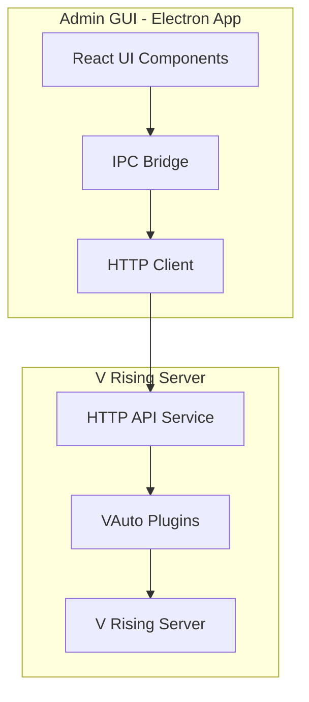
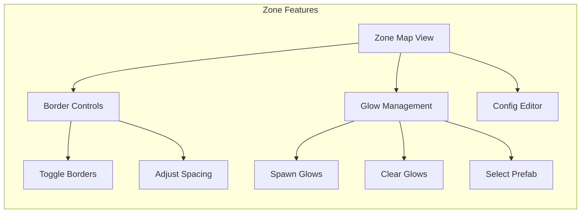
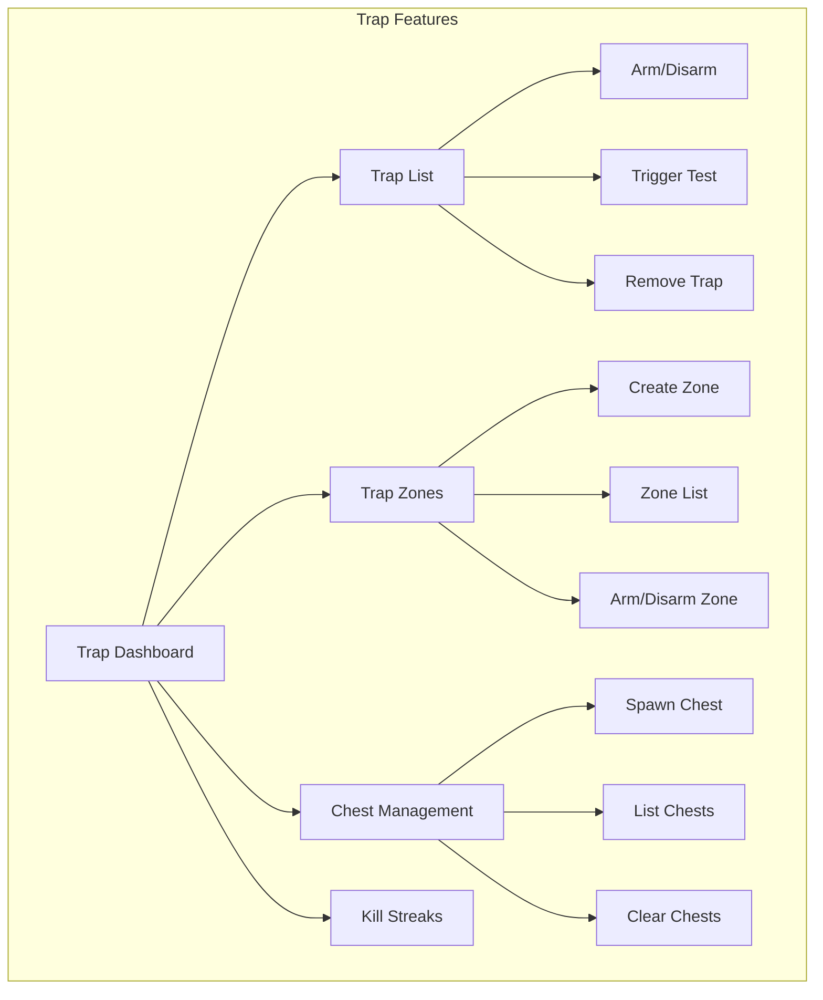

# V Rising Admin GUI Tool - Architecture Plan

## Overview

Build an Electron-based desktop application that provides a visual interface for managing V Rising server automation plugins (VAutoZone, VAutoTraps, VAutomationCore).

## Architecture Diagram



## Technology Stack

| Layer | Technology | Purpose |
|-------|------------|---------|
| Desktop Framework | Electron 28+ | Cross-platform desktop app |
| UI Framework | React 18 + TypeScript | Component-based UI |
| Build Tool | Vite + Electron Builder | Fast build & packaging |
| State Management | Zustand | Lightweight state |
| Styling | Tailwind CSS | Utility-first styling |
| Charts/Visuals | Recharts | Data visualization |
| Communication | HTTP + WebSocket | Server-GUI communication |

## Project Structure

```
VRisingAdminTools/
├── src/
│   ├── main/                 # Electron main process
│   │   ├── main.ts
│   │   ├── ipcHandler.ts     # IPC communication
│   │   └── tray.ts           # System tray
│   ├── preload/              # Preload scripts
│   ├── renderer/             # React UI
│   │   ├── components/       # Reusable components
│   │   ├── pages/           # Main pages
│   │   ├── hooks/           # Custom hooks
│   │   ├── services/        # API services
│   │   ├── stores/          # State stores
│   │   └── utils/           # Utilities
│   └── shared/              # Shared types
├── server/                  # V Rising plugin API
│   ├── HttpServer.cs
│   ├── Controllers/
│   └── Models/
├── resources/
│   ├── icons/
│   └── styles/
└── package.json
```

## Core Features

### 1. Dashboard Overview
- Server status (online/offline, player count)
- Active zones count
- Trap system status
- Recent events feed
- Quick action shortcuts

### 2. Zone Management (VAutoZone Integration)


**UI Components:**
- Interactive map showing arena zones and borders
- Glow border visualization with 3D coordinates
- Real-time zone status indicators
- One-click spawn/clear for glow borders
- Config parameters with live updates

### 3. Trap System (VAutoTraps Integration)


**UI Components:**
- Visual trap placement map
- Trap status grid (ARMED/DISARMED/TRIGGERED)
- Chest spawner with type selection (Normal/Rare/Epic/Legendary)
- Kill streak leaderboard/stats
- Real-time trap event notifications

### 4. Configuration Editor
- Live config editing for all plugins
- TOML/JSON file viewer
- Config validation before save
- Config version history/rollback
- Export/import configurations

### 5. Real-time Logs & Events
- Filterable log viewer
- Event categorization (Zone/Trap/Chest/Kill)
- Search and highlight functionality
- Export logs to file
- WebSocket for live updates

### 6. Player Tracking
- Online player list
- Player location tracking
- Kill streak display per player
- Trapped player alerts

## API Endpoints Required

### Server-Side (VAutomationCore)

| Method | Endpoint | Description |
|--------|----------|-------------|
| GET | `/api/status` | Get overall system status |
| GET | `/api/zones` | Get all zone data |
| POST | `/api/zones/glow/spawn` | Spawn glow borders |
| POST | `/api/zones/glow/clear` | Clear glow borders |
| PUT | `/api/zones/config` | Update zone config |
| GET | `/api/traps` | Get all trap data |
| POST | `/api/traps/set` | Set trap at location |
| POST | `/api/traps/remove` | Remove trap |
| POST | `/api/traps/arm` | Arm/disarm trap |
| POST | `/api/traps/trigger` | Test trigger trap |
| GET | `/api/chests` | Get spawned chests |
| POST | `/api/chests/spawn` | Spawn chest |
| POST | `/api/chests/remove` | Remove chest |
| GET | `/api/streaks` | Get kill streak data |
| POST | `/api/streaks/reset` | Reset player streak |
| GET | `/api/config` | Get full config |
| PUT | `/api/config` | Update config |
| GET | `/api/logs` | Get recent logs |
| WS | `/ws/events` | WebSocket for events |

## Security Layer

### Authentication Options
1. **RCON Password** - Reuse existing server password
2. **API Key** - Generate unique admin API key
3. **Certificate** - Mutual TLS authentication
4. **Local Only** - Only allow localhost connections

### Security Features
- Encrypted communication (HTTPS/WSS)
- Rate limiting on API endpoints
- Admin-only endpoints with permission checks
- Audit logging for admin actions
- Session timeout after inactivity

## Implementation Phases

### Phase 1: Foundation
- [ ] Set up Electron + React + TypeScript project
- [ ] Create basic window and navigation
- [ ] Implement HTTP client with WebSocket support
- [ ] Add basic authentication flow

### Phase 2: Server API Integration
- [ ] Add HTTP server to VAutomationCore
- [ ] Implement `/api/status` endpoint
- [ ] Implement zone endpoints
- [ ] Implement trap endpoints
- [ ] Add WebSocket event streaming

### Phase 3: Dashboard & Zone UI
- [ ] Build main dashboard layout
- [ ] Create zone map visualization
- [ ] Implement glow border controls
- [ ] Add zone configuration editor

### Phase 4: Trap System UI
- [ ] Build trap management dashboard
- [ ] Create trap zone editor
- [ ] Implement chest spawner UI
- [ ] Add kill streak statistics

### Phase 5: Advanced Features
- [ ] Configuration editor with validation
- [ ] Real-time log viewer with filtering
- [ ] Player tracking view
- [ ] Event notifications

### Phase 6: Polish & Distribution
- [ ] System tray integration
- [ ] Auto-update mechanism
- [ ] Multi-language support
- [ ] Package for Windows/Linux/macOS

## UI Mockup - Main Dashboard

```
┌─────────────────────────────────────────────────────────────────┐
│ V Rising Admin Tools v1.0                              ─ □ x  │
├─────────────────────────────────────────────────────────────────┤
│ [Dashboard] [Zones] [Traps] [Config] [Logs] [Players]        │
├─────────────────────────────────────────────────────────────────┤
│                                                                 │
│  ┌─ Server Status ───┐  ┌─ Quick Actions ───┐                │
│  │ ● Online           │  │ [Spawn Glows]     │                │
│  │ 12/50 Players      │  │ [Clear Traps]     │                │
│  │ Uptime: 2h 34m     │  │ [Reload Config]   │                │
│  └────────────────────┘  └────────────────────┘                │
│                                                                 │
│  ┌─ Active Zones ────────┐  ┌─ Trap System ────────┐          │
│  │ Zone A: ● Active      │  │ Traps: 8 (6 armed)    │          │
│  │ Zone B: ● Active      │  │ Zones: 3 (2 armed)   │          │
│  │ Zone C: ○ Inactive    │  │ Chests: 4 spawned    │          │
│  │ Zone D: ● Active      │  │ Streaks: 12 active   │          │
│  └───────────────────────┘  └───────────────────────┘          │
│                                                                 │
│  ┌─ Recent Events ───────────────────────────────────────────┐│
│  │ [14:32] Zone A border spawned (12 glows)                  ││
│  │ [14:30] Player_1 triggered trap at (120, 45, 200)          ││
│  │ [14:28] Chest spawned: Legendary at (115, 42, 195)         ││
│  │ [14:25] Kill streak: Player_2 reached 10 kills!           ││
│  └────────────────────────────────────────────────────────────┘│
└─────────────────────────────────────────────────────────────────┘
```

## Dependencies

### GUI Tool Dependencies
```json
{
  "electron": "^28.0.0",
  "react": "^18.2.0",
  "react-dom": "^18.2.0",
  "typescript": "^5.3.0",
  "vite": "^5.0.0",
  "@electron/rebuild": "^3.6.0",
  "zustand": "^4.5.0",
  "axios": "^1.6.0",
  "recharts": "^2.10.0",
  "tailwindcss": "^3.4.0",
  "electron-builder": "^24.9.0"
}
```

### V Rising Plugin Dependencies
- **Krafs.Publicizer** - For accessing internal Unity methods
- **LiteNetLib** - For WebSocket support (or use existing HTTP server)
- **Newtonsoft.Json** - For JSON serialization

## Next Steps

1. **Approve this plan** - Confirm architecture and features
2. **Set up project** - Initialize Electron + React project
3. **Start implementation** - Begin with Phase 1 (Foundation)
