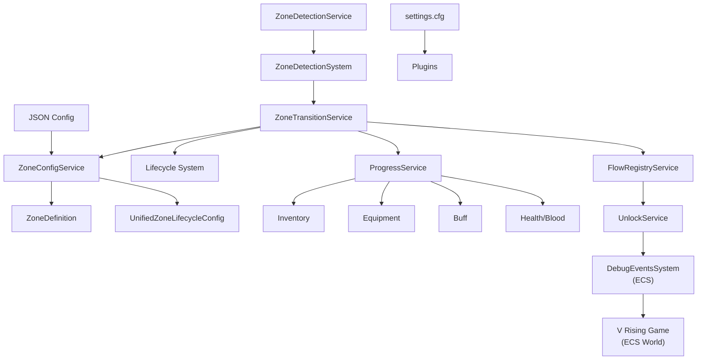
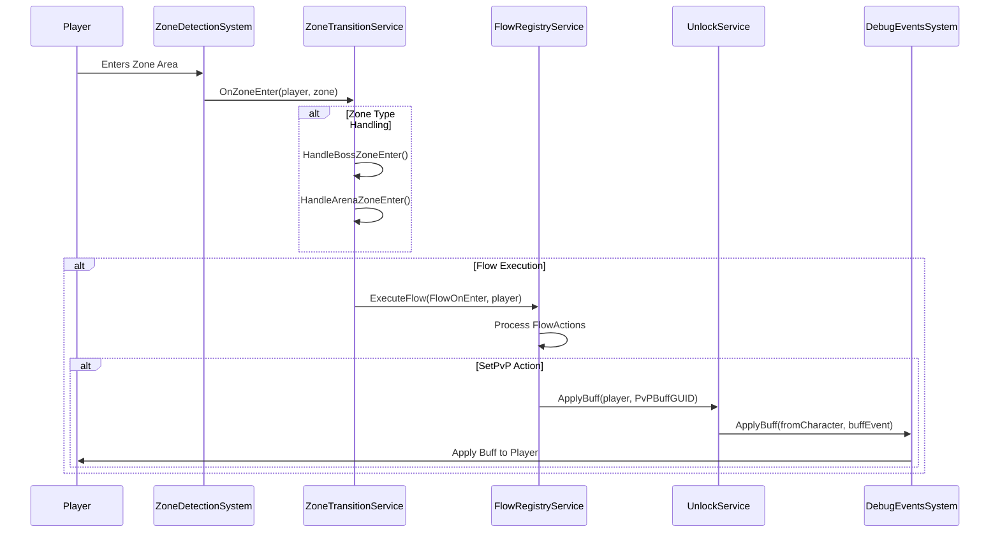
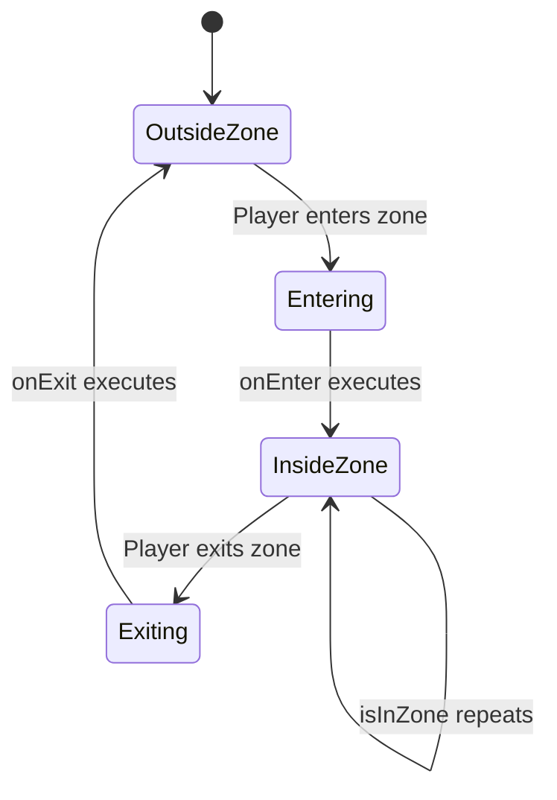
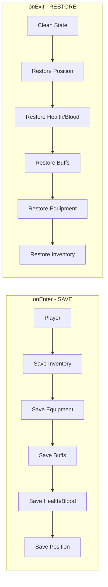

# Zone + Buff + Equipment + Inventory System Visual Plan

## Overview
This document provides a visual representation of how zones, buffs, equipment, inventory, and auto-enter/exit work together in VAutomationCore/Blueluck plugin.

---

## Complete System Architecture



---

## Zone Entry → Buff Sequence



---

## Three-Stage Lifecycle: Auto Enter/Exit



---

## Progress Save/Restore: Inventory & Equipment



---

## Configuration: JSON vs Settings.cfg

**JSON Files (config/):**
- zones.json - Zone definitions
- flows.json - Flow actions  
- VAuto.unified_config.json - Unified settings

**Settings.cfg (BepInEx):**
- enableLogging
- logLevel
- apiPort
- Plugin-specific toggles

---

## ECS Zone Event Systems

| System | File | Purpose |
|--------|------|---------|
| ZoneBuffSpawnSystem | Blueluck/ECS/Systems/ | Processes ZoneApplyBuffEvent, ZoneRemoveBuffEvent, ZoneSendMessageEvent |
| ZoneBossSystem | Blueluck/ECS/Systems/ | Processes ZoneSpawnBossEvent, ZoneRemoveBossEvent |
| ZoneDetectionSystem | Blueluck/Systems/ | Monitors player positions for zone transitions |

## ECS Event Components

- ZoneApplyBuffEvent - triggers buff application
- ZoneRemoveBuffEvent - triggers buff removal
- ZoneSendMessageEvent - triggers chat message
- ZoneSpawnBossEvent - triggers boss spawn
- ZoneRemoveBossEvent - triggers boss removal

---

## Zone Configuration JSON Structure

```json
{
  "zones": [
    {
      "type": "ArenaZone",
      "name": "PvPArena",
      "hash": 12345678,
      "center": [100.0, 50.0, -200.0],
      "entryRadius": 50.0,
      "exitRadius": 60.0,
      "enabled": true,
      "flowOnEnter": "arena_enter",
      "flowOnExit": "arena_exit"
    }
  ]
}
```

## Flow Configuration (flows.json)

```json
{
  "flows": {
    "arena_enter": [
      { "action": "zone.setpvp", "value": true },
      { "action": "zone.apply_buff", "prefab": "VIB_Generic_Buff" }
    ]
  }
}
```

## Unified Config (vlifecycle)

```json
{
  "vlifecycle": {
    "arena": {
      "saveInventory": true,
      "restoreInventory": true,
      "saveBuffs": true,
      "clearArenaBuffsOnExit": true
    },
    "playerState": {
      "saveEquipment": true,
      "saveBlood": true,
      "saveHealth": true
    }
  }
}
```

---

## Implementation Checklist

- [x] Zone Detection & Lifecycle
- [x] ProgressService - save/restore inventory, equipment, buffs, health, blood
- [x] Buff Application via DebugEventsSystem
- [x] Flow system with zone.setpvp, zone.apply_buff
- [x] JSON configuration for zones and flows
- [x] Auto-save on enter, auto-restore on exit

---

*Generated: 2026-03-05*